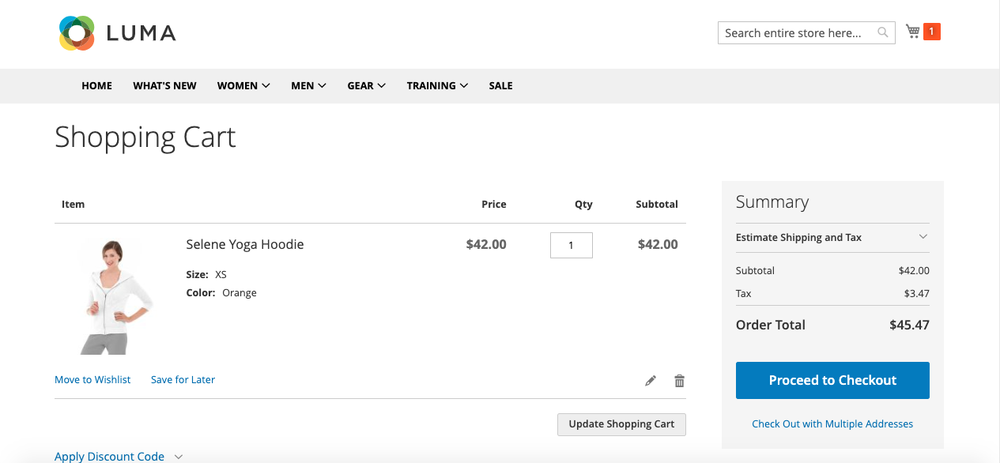
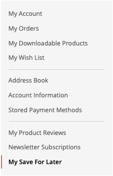
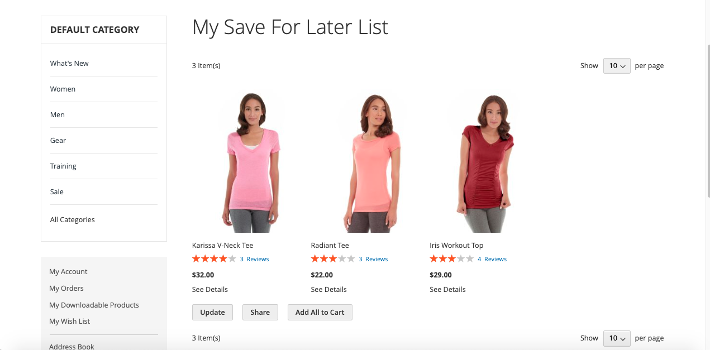

# Save For Later Extension for Magento 2

The "Save For Later" extension for Magento 2 makes shopping easier. It lets logged-in customers save products they like but aren't ready to buy yet, similar to what you see on Amazon. This way, shoppers can keep track of what they're interested in without having to make a purchase right away.

By adding this feature to your store, you're giving customers more flexibility and making it easier for them to shop at their own pace. Admins can enable or disable the module And also can view which products customers have saved, along with the quantity of each item. Furthermore, they can analyze this data through intuitive graphs, such as daily activity metrics, popular product trends, monthly insights, and yearly overviews.

The "Save for Later" module helps admins understand what customers like, so they can make the website better for everyone. This means happier customers and smarter marketing.

## Features

- Easy to use
- User-friendly interface
- Users can effortlessly save products for later
- Admins can easily configure the module

## Installation

You can install the Mdbhojwani Save For Later Extension using one of two methods:
 1. Via Composer 
 2. By downloading it directly from the available source.
 
### 1. Install via composer

To install the Mdbhojwani Save For Later Extension via Composer, follow these steps in  your Magento 2 root folder:

Run the following command:
```shell
composer require mdbhojwani/magento2-save-for-later
```
After a successful installation, execute the following commands:

```shell
php bin/magento setup:upgrade
php bin/magento setup:static-content:deploy -f
php bin/magento c:c
```

With these steps completed, you'll be ready to utilize the Yudiz Save For Later Extension.

### 2. Download Directly

To install the Mdbhojwani Save For Later Extension you can download the Extension from below link:

https://github.com/mdbhojwani/magneto2-save-for-later

After successfully downloading the module, follow these steps to install it:

1.Unzip the downloaded folder.

2.Place the unzipped extension folder into the following path:

```shell
project-root-directory/app/code/Mdbhojwani/SaveForLater
```

Indeed, after placing the extension folder in the specified directory, follow these Magento commands to complete the installation:
```shell
php bin/magento setup:upgrade
php bin/magento setup:static-content:deploy -f
php bin/magento c:c
```

By following these 2 Ways you can easily obtain and install the module. For detailed instructions on its usage, refer to the user guide within this document.

## Magento 2 Save For Later User Guide

Login to the **Magento Admin**, navigate to Configurations
Path: `Store > Configurations -> Mdbhojwani -> Save For Later `.

<div>
    
</div><br/>

Click on "Save", which will save the configuration.

## Frontend 

After a customer adds a product to the cart, customer can see the "Save for Later" button in cart page against each cart item.
Only logged-in customers can use the "Save for Later" option to add products.

<div>
    
</div><br/>

Upon clicking this button, all products in the cart will be moved to the "Save for Later" section. 

To access this section, customers can navigate to "My Account" and find the "Save for Later" tab. Here, they can view all the products they have moved for later consideration.

<div>
    
</div><br/>

<div>
    
</div><br/>


As you can see in the above screenshot, customers can easily manage products from the "Save for Later" section. They can add products back to the cart, adjust the quantity, and remove items. However, if a product is out of stock or the desired quantity isn't available, it won't be added to the cart.

Following the actions described, customers will receive messages similar to those shown in the screenshots. Whether they add, remove, or encounter any issues, appropriate messages will be displayed for clarity and guidance.
