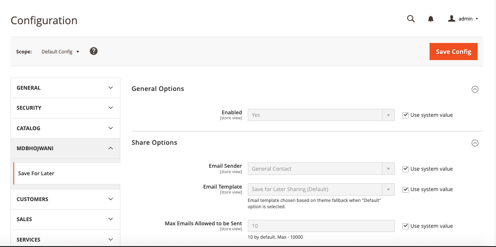
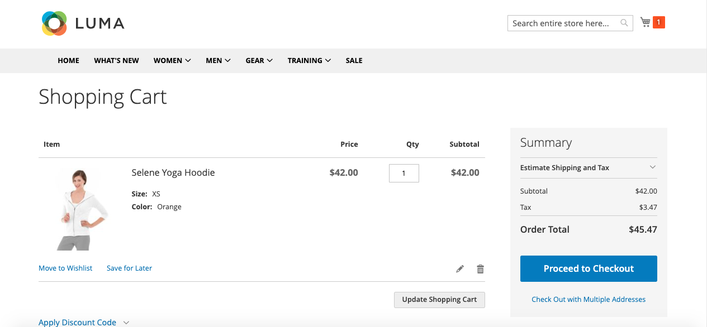
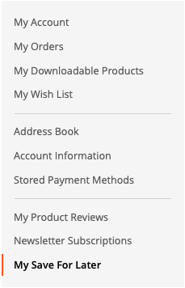

<strong>Magento 2 Save For Later Extension</strong> 

## Table of contents

- [Summary](#summary)
- [Configurations](#configurations)
- [Installation](#installation)
- [License](#license)

## Summary

The Magento 2 "Save for Later" extension makes shopping easier by allowing logged-in customers to save products they like but aren't ready to purchase yet, similar to the functionality seen on platforms like Amazon, Flipkart, and Myntra. This way, shoppers can keep track of items they're interested in without needing to make an immediate purchase.

By adding this feature to your store, you're offering customers more flexibility and enabling them to shop at their own pace. Admins can enable or disable the module and view which products customers have saved, along with the quantity of each item. Additionally, admins can analyze this data through intuitive graphs, such as daily activity metrics, popular product trends, monthly insights, and yearly overviews.

The "Save for Later" module helps admins understand customer preferences, allowing them to enhance the website and improve the overall shopping experience. This leads to happier customers and more effective marketing.

## Installation

You can install the Mdbhojwani Save For Later Extension using one of two methods:
 1. Via Composer 
 2. By downloading it directly from the available source.
 
### 1. Install via composer

To install the Mdbhojwani Save For Later Extension via Composer, follow these steps in  your Magento 2 root folder:

Run the following command:
```shell
composer require mdbhojwani/magento2-save-for-later
```
After a successful installation, execute the following commands:

```shell
php bin/magento setup:upgrade
php bin/magento setup:static-content:deploy -f
php bin/magento c:c
```

With these steps completed, you'll be ready to utilize the Yudiz Save For Later Extension.

### 2. Download Directly

To install the Mdbhojwani Save For Later Extension you can download the Extension from below link:

https://github.com/mdbhojwani/magneto2-save-for-later

After successfully downloading the module, follow these steps to install it:

1.Unzip the downloaded folder.

2.Place the unzipped extension folder into the following path:

```shell
project-root-directory/app/code/Mdbhojwani/SaveForLater
```

Indeed, after placing the extension folder in the specified directory, follow these Magento commands to complete the installation:
```shell
php bin/magento setup:upgrade
php bin/magento setup:static-content:deploy -f
php bin/magento c:c
```

By following these 2 Ways you can easily obtain and install the module. For detailed instructions on its usage, refer to the user guide within this document.


## Configurations

Login to the **Magento Admin**, navigate to Configurations
Path: `Store > Configurations -> Mdbhojwani -> Save For Later `.

<div>
    
</div><br/>

Click on "Save", which will save the configuration.


## Frontend 

After a customer adds a product to their cart, they will see the "Save for Later" button next to each cart item. Only logged-in customers can use the "Save for Later" option to move products.

<div>
    
</div><br/>

When this button is clicked, all selected products will be moved to the "Save for Later" section.

To access this section, customers can navigate to "My Account" and click on the "Save for Later" tab, where they can view all the products they have saved for future consideration.

<div>
    
</div><br/>

<div>
    
</div><br/>

As shown in the screenshot above, customers can easily manage products in the "Save for Later" section. They can add items back to the cart, adjust quantities, or remove products. However, if a product is out of stock or the desired quantity is unavailable, it will not be added back to the cart.

Customers will also receive notifications, similar to those shown in the screenshots, whenever they add, remove, or encounter any issues. These messages provide clear guidance and feedback.


## License

[Open Software License ("OSL") v. 3.0](https://opensource.org/license/osl-3-0-php)
